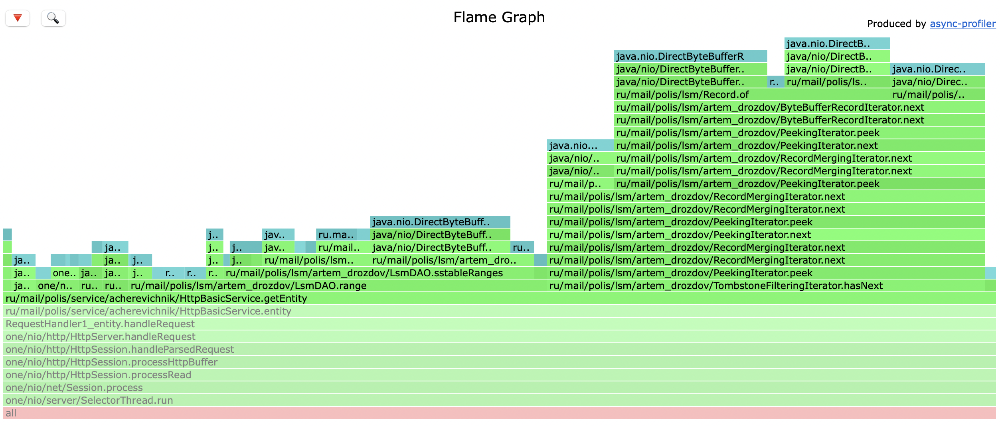

### Disclaimer
Хостинг, нагрузочное тестирование и профилирование проводилось на виртуальной машине Linux x86_64 средствами 
[lima](https://github.com/lima-vm/lima) на физическом процессоре Apple Silicon M1.

## Нагрузочное тестирование `PUT` при пустой базе

Результаты wrk2:

```
octav@lima-default:~$ wrk -c 1 -t 1 -d 2m -L -R 1000 -s wrk/put.lua http://localhost:8080
Running 2m test @ http://localhost:8080
  1 threads and 1 connections
  Thread calibration: mean lat.: 4123.776ms, rate sampling interval: 10543ms
  Thread Stats   Avg      Stdev     Max   +/- Stdev
    Latency     9.85s     1.15s   11.30s    71.59%
    Req/Sec     0.94k    69.94     0.99k    90.00%
----------------------------------------------------------
  108697 requests in 2.00m, 7.77MB read
Requests/sec:    906.01
Transfer/sec:     66.34KB
```

[FlameGraph cpu](profile_flamegraphs/cpu_put_empty_profile.html)

[FlameGraph alloc](profile_flamegraphs/alloc_put_empty_profile.html)


Как видно из результатов профайла при обработке запроса нашим сервисом ресурсы cpu используются только DAO,
тем самым у нас нет возможность оптимизировать `PUT` запрос при новой записи.

## Нагрузочное тестирование `PUT` уже существующих записей

Результаты wrk2:

```
octav@lima-default:~$ wrk -c 1 -t 1 -d 10m -L -R 500 -s wrk/put.lua http://localhost:8080
Running 10m test @ http://localhost:8080
  1 threads and 1 connections
  Thread calibration: mean lat.: 159.869ms, rate sampling interval: 1208ms
  Thread Stats   Avg      Stdev     Max   +/- Stdev
    Latency    16.64s    21.64s    1.14m    78.25%
    Req/Sec   501.48    338.03     1.04k    52.58%
----------------------------------------------------------
  299478 requests in 10.00m, 21.60MB read
  Socket errors: connect 0, read 0, write 0, timeout 66
Requests/sec:    499.14
Transfer/sec:     36.86KB
```

[FlameGraph cpu](profile_flamegraphs/cpu_put_existed_profile.html)

[FlameGraph alloc](profile_flamegraphs/alloc_put_existed_profile.html)


По данным профайла возможных оптимизаций кода не нахожу.

## Нагрузочное тестирование `GET` полной базы

Результаты wrk2:

```
wrk -c 1 -t 1 -d 2m -R 1000 -L -s wrk/get.lua http://localhost:8080
Running 2m test @ http://localhost:8080
  1 threads and 1 connections
  Thread calibration: mean lat.: 4775.365ms, rate sampling interval: 15032ms
  Thread Stats   Avg      Stdev     Max   +/- Stdev
    Latency    20.05s     6.77s   33.51s    67.39%
    Req/Sec   768.00    110.33     0.92k    42.86%
----------------------------------------------------------
  86446 requests in 2.00m, 6.00MB read
Requests/sec:    720.57
Transfer/sec:     51.20KB
```

[FlameGraph cpu](profile_flamegraphs/cpu_get_existed_profile.html)

[FlameGraph alloc](profile_flamegraphs/alloc_get_existed_profile.html)




## Нагрузочное тестирование `GET` пустой базы

Результаты wrk2:

```
wrk -c 1 -t 1 -d 2m -R 1000 -L -s wrk/get.lua http://localhost:8080
Running 2m test @ http://localhost:8080
  1 threads and 1 connections
  Thread calibration: mean lat.: 4083.163ms, rate sampling interval: 10567ms
  Thread Stats   Avg      Stdev     Max   +/- Stdev
    Latency    20.43s     2.79s   25.41s    78.31%
    Req/Sec   811.40    221.88     1.01k    90.00%
----------------------------------------------------------
  94539 requests in 2.00m, 6.22MB read
  Non-2xx or 3xx responses: 94539
Requests/sec:    788.14
Transfer/sec:     53.11KB
```

[FlameGraph cpu](profile_flamegraphs/cpu_get_empty_profile.html)

[FlameGraph alloc](profile_flamegraphs/alloc_get_empty_profile.html)


Как видно из результатов профайла при обработке запроса нашим сервисом ресурсы cpu используются только DAO, 
тем самым у нас нет возможность оптимизировать `GET` запрос при пустой базе.

---

Довольно большая задержка объясняется использование виртуальной машины на процессоре Apple M1.
Из-за такой большой задержки, утилита wrk2 не успевает получить результаты всех запросов к концу тестирования.